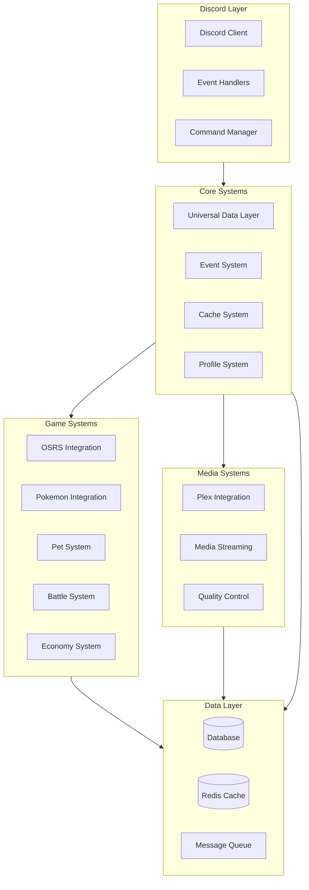

# System Architecture Overview

## Introduction

This document provides a comprehensive overview of the system architecture for our Discord bot that integrates OSRS, Pokemon, and Plex features. The architecture is designed to be modular, scalable, and maintainable while supporting cross-system interactions.

## High-Level Architecture

## Core Components

### 1. Discord Layer
- **Discord Client**: Handles Discord API interactions
- **Event Handlers**: Processes Discord events
- **Command Manager**: Manages command registration and execution

### 2. Core Systems
- **Universal Data Layer**: Provides unified data access
- **Event System**: Manages cross-system event propagation
- **Cache System**: Handles caching and performance optimization
- **Profile System**: Manages user profiles and progression

### 3. Game Systems
- **OSRS Integration**: Old School RuneScape features
- **Pokemon Integration**: Pokemon game features
- **Pet System**: Virtual pet management
- **Battle System**: Cross-game battle mechanics
- **Economy System**: Unified virtual economy

### 4. Media Systems
- **Plex Integration**: Media server integration
- **Media Streaming**: Handles media playback
- **Quality Control**: Manages streaming quality

### 5. Data Layer
- **Database**: Persistent storage (PostgreSQL)
- **Redis Cache**: In-memory caching
- **Message Queue**: Async task processing

## Cross-System Integration

The architecture supports cross-system interactions through:
1. Universal Data Layer for consistent data access
2. Event System for cross-system communication
3. Shared Economy for unified virtual currency
4. Achievement System spanning all features

## Security Considerations

1. **Authentication**
   - Discord OAuth2 integration
   - Role-based access control
   - Session management

2. **Data Protection**
   - Encrypted storage
   - Secure communication
   - Rate limiting

3. **API Security**
   - Input validation
   - Request signing
   - Token management

## Performance Optimization

1. **Caching Strategy**
   - Redis for hot data
   - Local memory caching
   - Cache invalidation

2. **Load Management**
   - Request throttling
   - Queue-based processing
   - Resource pooling

## Monitoring and Maintenance

1. **Health Checks**
   - Service status monitoring
   - Performance metrics
   - Error tracking

2. **Logging**
   - Structured logging
   - Error reporting
   - Audit trails

## Development Guidelines

1. **Code Organization**
   - Modular architecture
   - Clear separation of concerns
   - Consistent coding standards

2. **Testing Strategy**
   - Unit testing
   - Integration testing
   - End-to-end testing

3. **Documentation**
   - Code documentation
   - API documentation
   - System documentation

## Future Considerations

1. **Scalability**
   - Horizontal scaling
   - Service isolation
   - Load balancing

2. **New Features**
   - Additional game integrations
   - Enhanced media features
   - Extended social features

3. **Technical Debt**
   - Regular refactoring
   - Dependency updates
   - Performance optimization

## Related Documentation
- [Development Guide](../guides/development/README.md)
- [API Documentation](../api/README.md)
- [Deployment Guide](../guides/deployment/README.md)
- [Security Guide](../SECURITY.md)

_Last Updated: February 2024_ 