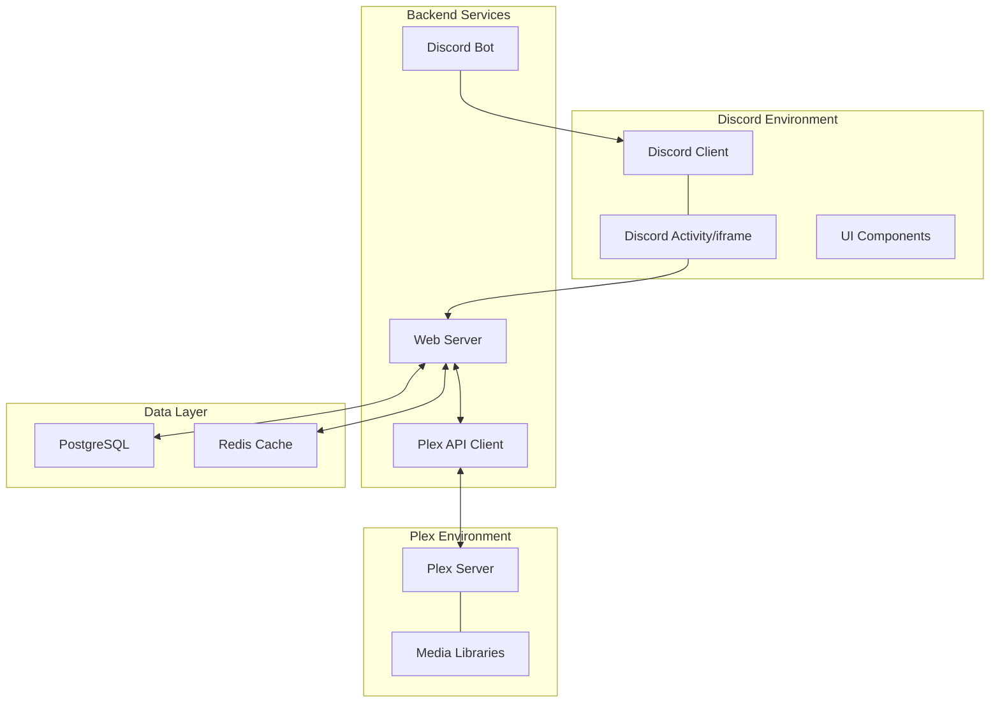
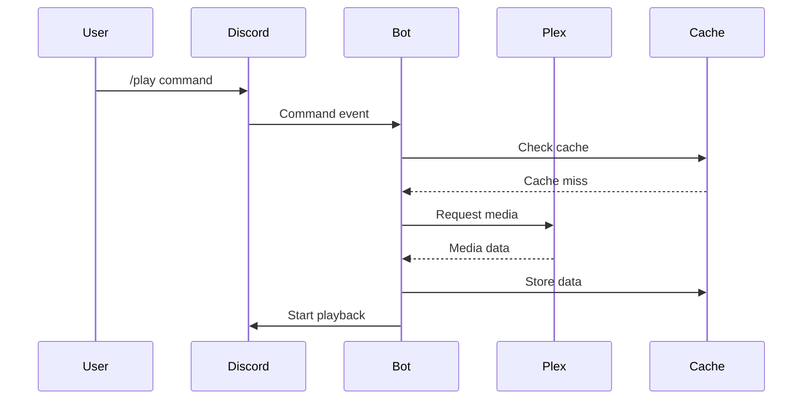
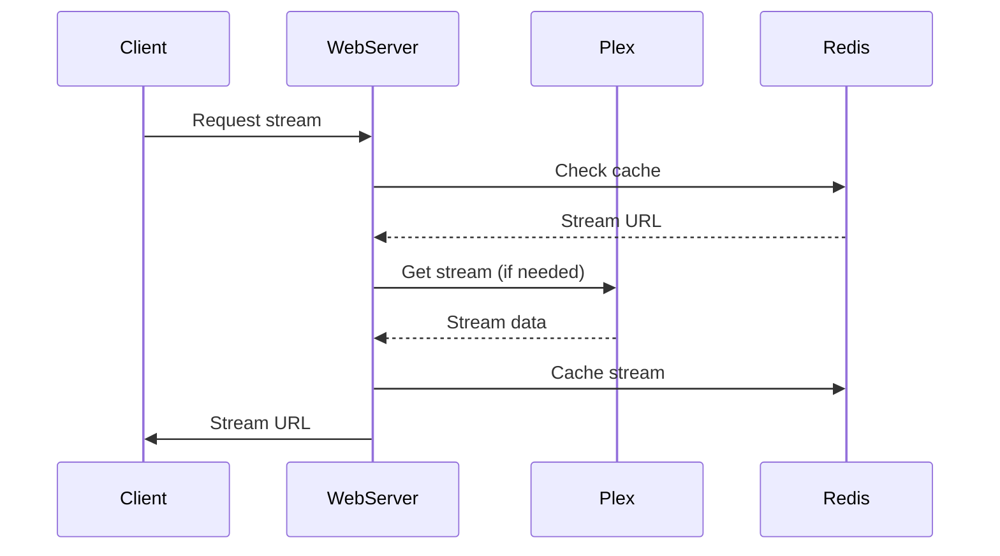
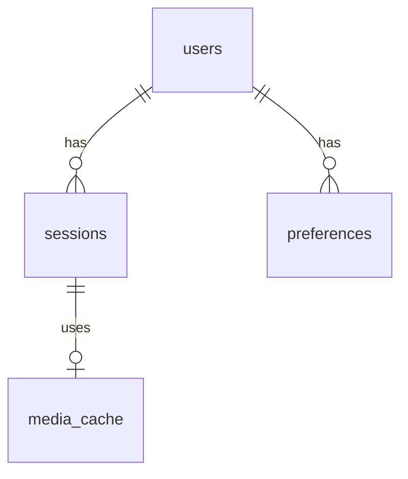
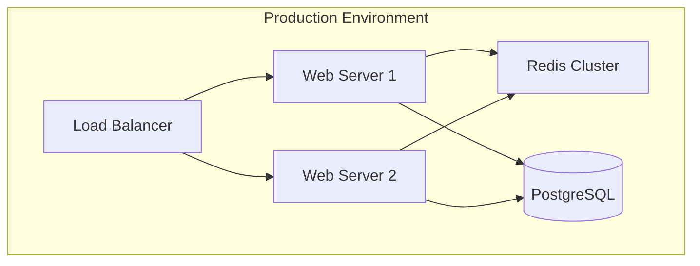
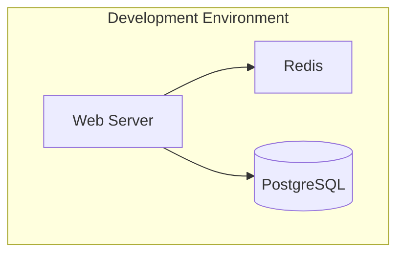

# Architecture Overview

## System Architecture

The Discord Plex Player is built using a microservices-inspired architecture with the following main components:



## Core Components

### 1. Discord Bot
- Built with discord.py
- Handles voice channel integration
- Manages commands and interactions
- Coordinates playback sessions

### 2. Web Server
- Flask-based REST API
- WebSocket server for real-time updates
- Handles media streaming
- Manages authentication

### 3. Plex Integration
- PlexAPI client wrapper
- Media metadata management
- Stream URL generation
- Library browsing

### 4. Frontend Player
- React-based web player
- Video.js integration
- WebSocket client
- Responsive design

## Data Flow

### 1. Command Flow


### 2. Streaming Flow


## Security Architecture

### 1. Authentication
- JWT-based authentication
- Discord OAuth2 integration
- Secure token storage
- Role-based access control

### 2. Data Protection
- Encrypted environment variables
- Secure database connections
- Token rotation system
- Rate limiting

### 3. Network Security
- HTTPS enforcement
- WebSocket security
- API authentication
- Request validation

## Caching Strategy

### 1. Redis Cache Layers
```
Level 1: Session Cache
- User sessions
- Active streams
- Playback state
TTL: 24 hours

Level 2: Media Cache
- Stream URLs
- Media metadata
- Search results
TTL: 15-60 minutes

Level 3: System Cache
- Library data
- User preferences
- Configuration
TTL: 5-30 minutes
```

### 2. Cache Invalidation
- Time-based expiration
- Manual invalidation
- Event-based updates
- Cascade updates

## Database Schema

### 1. Core Tables
```sql
-- Users
CREATE TABLE users (
    id SERIAL PRIMARY KEY,
    discord_id TEXT UNIQUE,
    settings JSONB
);

-- Sessions
CREATE TABLE sessions (
    id SERIAL PRIMARY KEY,
    user_id INTEGER REFERENCES users(id),
    media_id TEXT,
    status TEXT
);

-- Media Cache
CREATE TABLE media_cache (
    id SERIAL PRIMARY KEY,
    plex_id TEXT UNIQUE,
    metadata JSONB,
    expires_at TIMESTAMP
);
```

### 2. Relationships


## Scaling Considerations

### 1. Horizontal Scaling
- Stateless web servers
- Redis cluster
- Load balancing
- Session management

### 2. Vertical Scaling
- Database optimization
- Cache tuning
- Resource allocation
- Performance monitoring

### 3. Bottlenecks
- Media transcoding
- Database connections
- WebSocket connections
- Cache invalidation

## Monitoring and Logging

### 1. Metrics
- Request latency
- Cache hit rates
- Error rates
- Resource usage

### 2. Logging
- Structured logging
- Error tracking
- Audit trails
- Performance metrics

## Deployment Architecture

### 1. Production Setup


### 2. Development Setup


## Integration Points

### 1. External Services
- Discord API
- Plex Media Server
- OAuth providers
- Monitoring services

### 2. Internal Services
- Cache service
- Database service
- Media service
- Authentication service

## Future Architecture

### 1. Planned Improvements
- Microservices migration
- Container orchestration
- Service mesh
- Event sourcing

### 2. Scalability Enhancements
- Database sharding
- Global distribution
- Edge caching
- Async processing

## Additional Resources

- [Component Details](components.md)
- [Data Flow Documentation](data-flow.md)
- [Security Model](security.md)
- [API Documentation](../api/rest-api.md) 