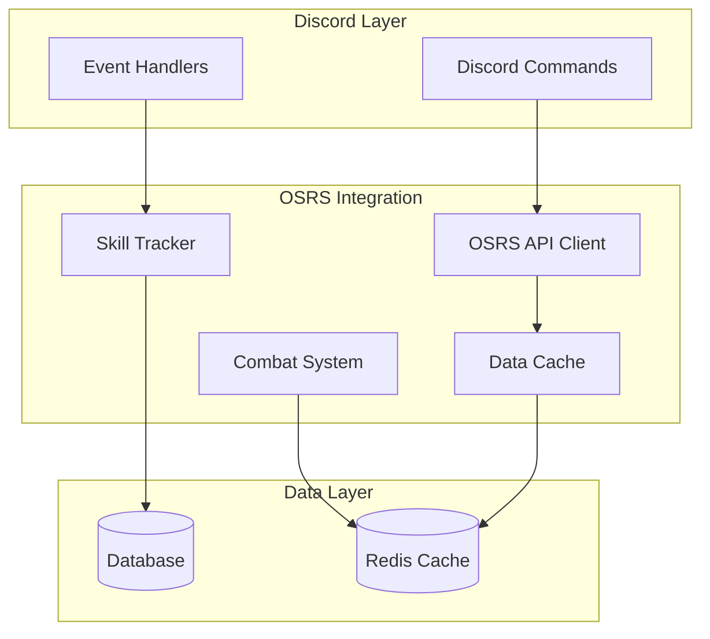

# OSRS Integration System

## Overview

The OSRS (Old School RuneScape) integration system provides seamless integration between Discord and OSRS game features, including skill tracking, achievements, and game-related commands.

## Features

- **Skill Tracking**: Real-time monitoring of player skills and experience
- **Achievement System**: Integration with OSRS achievements and milestones
- **Combat Integration**: Battle system integration with OSRS combat mechanics
- **Economy System**: Integration with OSRS trading and economy
- **Command System**: Comprehensive OSRS-related Discord commands

## System Architecture



## Components

### 1. OSRS API Client
- Handles communication with OSRS APIs
- Manages rate limiting and caching
- Provides data validation and transformation

### 2. Skill Tracker
- Real-time skill monitoring
- Experience tracking
- Level-up notifications
- Achievement tracking

### 3. Combat System
- Combat level calculation
- Battle mechanics integration
- Equipment and inventory management
- PvP and PvE support

### 4. Economy Integration
- Grand Exchange price tracking
- Trading system integration
- Virtual currency conversion
- Item database management

## Configuration

### Environment Variables
```env
OSRS_API_KEY=your_api_key
OSRS_CACHE_TTL=3600
OSRS_RATE_LIMIT=100
OSRS_API_ENDPOINT=https://api.osrs.example.com
```

### Redis Configuration
```yaml
redis:
  prefix: osrs
  ttl: 3600
  channels:
    updates: osrs:updates
    events: osrs:events
```

## API Reference

See [OSRS API Documentation](./api.md) for detailed API information.

## Commands

See [OSRS Commands](./commands.md) for available Discord commands.

## Events

### Emitted Events
- `osrs:levelup`: Emitted when a player gains a level
- `osrs:achievement`: Emitted when a player completes an achievement
- `osrs:combat`: Emitted during combat events
- `osrs:trade`: Emitted during trading events

### Handled Events
- `discord:command`: Handles Discord command events
- `system:cache`: Handles cache invalidation events
- `system:update`: Handles system update events

## Integration Points

### Input Interfaces
- Discord command handlers
- WebSocket event listeners
- HTTP API endpoints
- Cache update handlers

### Output Interfaces
- Discord message responses
- Event emissions
- Database updates
- Cache updates

## Error Handling

### Common Errors
- `OSRSApiError`: API communication errors
- `RateLimitError`: Rate limit exceeded
- `ValidationError`: Invalid data or parameters
- `CacheError`: Cache operation failures

### Recovery Procedures
1. API Errors: Implement exponential backoff
2. Rate Limits: Queue requests and retry
3. Cache Errors: Fallback to direct API calls

## Performance

### Metrics
- API response times
- Cache hit rates
- Command processing times
- Event processing latency

### Optimization
- Implement aggressive caching
- Use batch processing where possible
- Optimize database queries
- Implement request debouncing

## Security

### Authentication
- API key management
- Rate limiting
- Request validation
- Access control

### Data Protection
- Secure credential storage
- Data encryption
- Audit logging
- Access monitoring

## Testing

### Unit Tests
```bash
# Run OSRS integration tests
python -m pytest tests/integration/osrs/
```

### Integration Tests
```bash
# Run full integration test suite
python -m pytest tests/e2e/osrs/
```

## Troubleshooting

### Common Issues
1. API Connection Issues
   - Check API endpoint configuration
   - Verify network connectivity
   - Check rate limit status

2. Cache Problems
   - Verify Redis connection
   - Check cache configuration
   - Monitor cache usage

3. Data Synchronization
   - Check database connections
   - Verify event processing
   - Monitor sync status

## Related Documentation
- [Architecture Overview](../../architecture/overview.md)
- [API Documentation](../../api/README.md)
- [Development Guide](../../guides/development/README.md)

## Changelog

### v1.0.0 - 2024-02
- Initial OSRS integration
- Basic command support
- Skill tracking implementation

_Last Updated: February 2024_ 