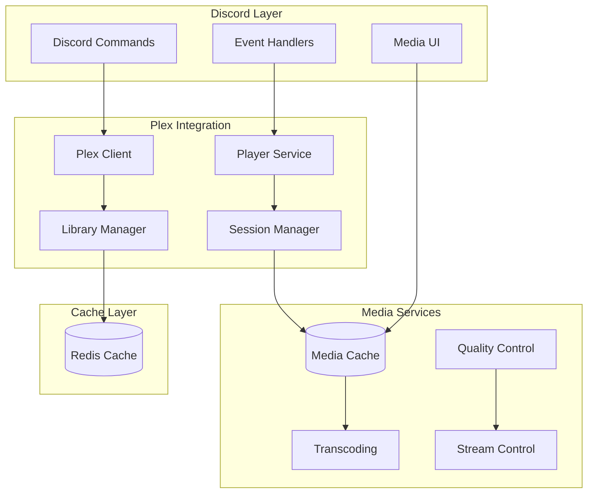

# Plex Integration System

## Overview

The Plex Integration System provides seamless integration between Discord and Plex Media Server, enabling media playback control, library management, and user session tracking. The system supports rich media information display and interactive media controls through Discord.

## System Architecture



## Features

### 1. Media Control
- Playback control (play, pause, stop)
- Seek and timeline navigation
- Volume control
- Player status monitoring

### 2. Library Management
- Browse media libraries
- Search content
- Manage playlists
- Track watch history

### 3. User Sessions
- Session tracking
- Multi-user support
- Device management
- Bandwidth monitoring

### 4. Quality Control
- Resolution selection
- Bitrate management
- Transcoding options
- Stream optimization

## Configuration

### Environment Variables
```env
PLEX_SERVER_URL=https://plex.example.com
PLEX_API_TOKEN=your_plex_token
PLEX_CLIENT_ID=discord_bot_client
PLEX_CACHE_TTL=3600
PLEX_MAX_BITRATE=20000
```

### Plex Server Settings
```yaml
server_settings:
  transcoding:
    enabled: true
    max_quality: "1080p"
    preferred_codec: "h264"
  streaming:
    direct_play: true
    direct_stream: true
    max_sessions: 5
```

## Media Control

### 1. Playback Control
```python
async def control_playback(session_id: str, action: str) -> bool:
    """Control media playback."""
    try:
        session = await get_session(session_id)
        
        match action:
            case "play":
                await session.play()
            case "pause":
                await session.pause()
            case "stop":
                await session.stop()
            case "seek":
                await session.seek(position)
                
        await update_session_state(session)
        return True
        
    except PlexError as e:
        await handle_playback_error(e)
        return False
```

### 2. Stream Management
```python
async def manage_stream(session_id: str, quality: str) -> None:
    """Manage stream quality and settings."""
    session = await get_session(session_id)
    
    # Update quality settings
    await session.set_quality(quality)
    
    # Check transcoding needs
    if needs_transcoding(session, quality):
        await start_transcoding(session)
    
    # Update stream settings
    await update_stream_settings(session)
```

## Library Integration

### 1. Media Browsing
```python
async def browse_library(library_id: str, filters: Dict = None) -> List[Media]:
    """Browse Plex media library."""
    library = await get_library(library_id)
    
    # Apply filters
    query = build_query(filters)
    
    # Fetch media items
    items = await library.search(query)
    
    # Cache results
    await cache_media_items(items)
    
    return items
```

### 2. Search Functionality
```python
async def search_media(query: str, library_id: str = None) -> List[Media]:
    """Search for media content."""
    # Build search query
    search_params = {
        "query": query,
        "library": library_id,
        "limit": 10
    }
    
    # Execute search
    results = await plex_client.search(**search_params)
    
    # Process results
    processed_results = [
        process_media_item(item)
        for item in results
    ]
    
    return processed_results
```

## Session Management

### 1. Session Tracking
```python
@event_handler
async def track_session(event):
    """Track Plex session events."""
    match event.type:
        case "session_start":
            await create_session(event.data)
        case "session_update":
            await update_session(event.data)
        case "session_end":
            await close_session(event.data)
```

### 2. User Management
```python
async def manage_user_session(user_id: str, device_id: str) -> Session:
    """Manage user session and device."""
    # Validate user access
    await validate_user_access(user_id)
    
    # Check device limits
    if await check_device_limit(user_id):
        raise SessionError("Device limit reached")
    
    # Create session
    session = await create_user_session(user_id, device_id)
    
    # Initialize playback
    await initialize_playback(session)
    
    return session
```

## Discord Integration

### Command Interface
```
/plex play <title>
/plex pause
/plex stop
/plex seek <time>
/plex quality <resolution>
/plex search <query>
```

### Media Display
```
🎬 Now Playing
Title: The Matrix
Quality: 1080p
Progress: 01:15:30 / 02:16:00
Status: Playing

Controls:
⏮️ Previous  ⏯️ Play/Pause  ⏭️ Next
🔉 Volume: 80%  📺 Quality: 1080p
```

## Error Handling

### Plex Errors
```python
class PlexError(Exception):
    """Base class for Plex errors"""
    pass

class StreamError(PlexError):
    """Streaming error occurred"""
    pass

class SessionError(PlexError):
    """Session error occurred"""
    pass

class MediaError(PlexError):
    """Media playback error"""
    pass
```

### Error Recovery
1. Stream reconnection
2. Session recovery
3. Quality adjustment
4. Cache refresh

## Performance

### Optimization
- Media metadata caching
- Stream quality optimization
- Session state caching
- Command debouncing

### Metrics
- Stream latency
- Transcoding time
- Cache hit ratio
- Command response time

## Testing

### Unit Tests
```python
def test_playback_control():
    session = create_test_session()
    
    assert control_playback(session.id, "play")
    assert session.status == "playing"
    
    assert control_playback(session.id, "pause")
    assert session.status == "paused"
```

### Integration Tests
```python
async def test_stream_management():
    session = await create_test_session()
    
    await manage_stream(session.id, "1080p")
    
    assert session.quality == "1080p"
    assert session.transcoding == "direct"
```

## Related Documentation
- [Plex Commands](./commands.md)
- [Streaming Setup](./streaming.md)
- [Quality Management](./quality.md)
- [API Documentation](../api/plex/README.md)

## Changelog

### v1.0.0 - 2024-02-16
- Initial Plex integration
- Basic playback controls
- Library management
- Session tracking

_Last Updated: February 2024_ 