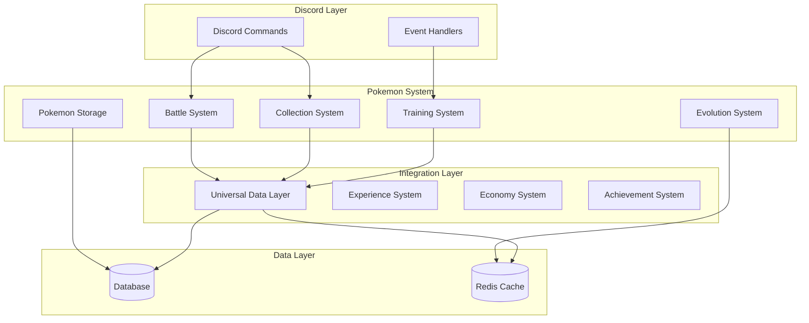

# Pokemon Integration System

## Overview

The Pokemon integration system provides a comprehensive Pokemon experience within Discord, including battle mechanics, collection systems, and training features. This system integrates with the Universal Data Layer to support cross-system interactions.

## Features

- **Battle System**: Complete Pokemon battle mechanics
- **Collection System**: Pokemon catching and storage
- **Training System**: Level up and evolve Pokemon
- **Trading System**: Trade Pokemon with other users
- **Achievement System**: Pokemon-related achievements
- **Cross-System Integration**: Interact with other game systems

## System Architecture



## Components

### 1. Battle System
- Turn-based combat
- Type effectiveness
- Move system
- Status effects
- Team management

### 2. Collection System
- Pokemon catching
- Storage boxes
- Pokedex tracking
- Rarity system
- Form variations

### 3. Training System
- Experience gain
- Level progression
- Move learning
- Evolution tracking
- Stat calculation

### 4. Trading System
- Player trading
- Trade validation
- Value calculation
- Trade history
- Market system

## Configuration

### Environment Variables
```env
POKEMON_API_KEY=your_api_key
POKEMON_DATA_PATH=/path/to/data
POKEMON_CACHE_TTL=3600
POKEMON_RATE_LIMIT=100
```

### Redis Configuration
```yaml
redis:
  prefix: pokemon
  ttl: 3600
  channels:
    battles: pokemon:battles
    trades: pokemon:trades
    events: pokemon:events
```

## Integration Points

### Input Interfaces
- Discord commands
- Event handlers
- Trading system
- Battle system

### Output Interfaces
- Battle results
- Trade confirmations
- Achievement notifications
- Level up messages

## Events

### Emitted Events
- `pokemon:catch`: Pokemon caught
- `pokemon:evolve`: Evolution occurred
- `pokemon:trade`: Trade completed
- `pokemon:battle`: Battle completed

### Handled Events
- `discord:command`: Command execution
- `system:save`: Data persistence
- `system:load`: Data loading
- `system:update`: System updates

## Error Handling

### Common Errors
- `PokemonNotFound`: Pokemon doesn't exist
- `InvalidMove`: Move not available
- `TradeError`: Trade validation failed
- `BattleError`: Battle execution failed

### Recovery Procedures
1. Data corruption: Restore from backup
2. Battle errors: Reset battle state
3. Trade errors: Rollback transaction

## Performance

### Metrics
- Battle processing time
- Trade completion rate
- Cache hit ratio
- API response times

### Optimization
- Battle state caching
- Pokemon data preloading
- Move calculation optimization
- Type effectiveness lookup tables

## Security

### Authentication
- Trade validation
- Battle verification
- Data access control
- Rate limiting

### Data Protection
- Pokemon ownership verification
- Trade logging
- Battle replay storage
- Backup systems

## Testing

### Unit Tests
```bash
# Run Pokemon system tests
python -m pytest tests/pokemon/
```

### Integration Tests
```bash
# Run cross-system tests
python -m pytest tests/integration/pokemon/
```

## Troubleshooting

### Common Issues
1. Battle System Issues
   - Check battle state
   - Verify move validity
   - Check type calculations

2. Trading Issues
   - Verify trade data
   - Check player inventories
   - Validate trade values

3. Evolution Issues
   - Check evolution conditions
   - Verify level requirements
   - Check item requirements

## Related Documentation
- [Pokemon API](./api.md)
- [Pokemon Commands](./commands.md)
- [Battle System](./battle-system.md)
- [Trading System](./trading-system.md)

## Changelog

### v1.0.0 - 2024-02
- Initial Pokemon system implementation
- Basic battle mechanics
- Collection system
- Trading functionality

_Last Updated: February 2024_ 