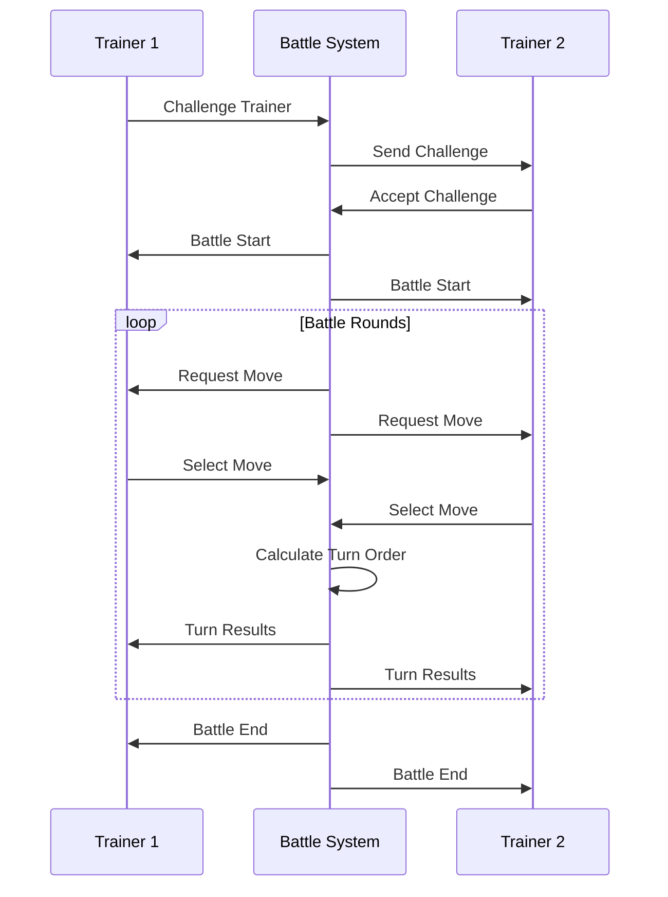

# Pokemon Battle System

## Overview

The Pokemon Battle System implements turn-based Pokemon battles with full support for moves, abilities, items, and status effects. The system integrates with the Universal Data Layer to support cross-system battle mechanics.

## Battle Flow



## Battle States

### 1. Pre-Battle
- Team validation
- Rule checking
- Trainer readiness
- Environment setup

### 2. Active Battle
- Turn processing
- Move selection
- Damage calculation
- Status effect handling

### 3. Post-Battle
- Experience calculation
- Reward distribution
- State cleanup
- History recording

## Battle Rules

### Format Types
- Singles (1v1)
- Doubles (2v2)
- Multi (2v2v2v2)
- Free-for-all (1v1v1v1)

### Level Rules
```yaml
level_caps:
  standard: 50
  competitive: 100
  scaled: true  # Auto-scale to highest Pokemon
```

### Item Rules
```yaml
items:
  held_items: true
  battle_items: true
  restricted_items:
    - "Quick Claw"
    - "Focus Sash"
```

## Battle Mechanics

### 1. Turn Order
```python
def calculate_turn_order(pokemon1, pokemon2):
    # Base speed comparison
    if pokemon1.speed > pokemon2.speed:
        return pokemon1, pokemon2
    
    # Priority moves override speed
    if pokemon1.selected_move.priority > pokemon2.selected_move.priority:
        return pokemon1, pokemon2
        
    # Speed tie breaker
    if pokemon1.speed == pokemon2.speed:
        return random.choice([(pokemon1, pokemon2), (pokemon2, pokemon1)])
```

### 2. Damage Calculation
```python
def calculate_damage(move, attacker, defender):
    # Base damage
    base = (2 * attacker.level / 5 + 2) * move.power
    
    # Attack/Defense ratio
    if move.category == "Physical":
        ratio = attacker.attack / defender.defense
    else:
        ratio = attacker.sp_attack / defender.sp_defense
        
    # Modifiers
    modifiers = [
        type_effectiveness(move.type, defender.types),
        critical_hit(),
        random.uniform(0.85, 1.0)
    ]
    
    return base * ratio * math.prod(modifiers)
```

### 3. Status Effects
```python
class StatusEffect:
    def __init__(self, type, duration):
        self.type = type
        self.duration = duration
        
    def apply(self, pokemon):
        if self.type == "Burn":
            pokemon.attack *= 0.5
            pokemon.hp -= pokemon.max_hp / 8
        # ... other status effects
```

## Battle Events

### Event Types
1. **Turn Events**
   - Move selection
   - Damage calculation
   - Status application
   - Item usage

2. **Field Events**
   - Weather changes
   - Terrain effects
   - Entry hazards
   - Field conditions

3. **Pokemon Events**
   - Switching
   - Fainting
   - Form changes
   - Ability triggers

### Event Handling
```python
@event_handler
async def handle_battle_event(event):
    match event.type:
        case "move_used":
            await process_move(event.data)
        case "pokemon_switched":
            await handle_switch(event.data)
        case "item_used":
            await process_item(event.data)
        case "pokemon_fainted":
            await handle_faint(event.data)
```

## Battle UI

### Command Interface
```
/battle move <move_name>
/battle switch <position>
/battle item <item_name>
/battle forfeit
```

### Battle Display
```
⚔️ Battle: User1 vs User2
Turn: 3

User1's Pikachu (45/45 HP) ⚡
Status: None
Moves: Thunder Shock, Quick Attack, Thunder Wave

User2's Charmander (30/39 HP) 🔥
Status: Paralyzed
Moves: ???

Select your move:
1. Thunder Shock
2. Quick Attack
3. Thunder Wave
```

## Integration Points

### Input Systems
- Command processing
- Event handling
- State management
- Data validation

### Output Systems
- Battle results
- Experience gains
- Achievement tracking
- Statistics recording

## Error Handling

### Battle Errors
```python
class BattleError(Exception):
    """Base class for battle errors"""
    pass

class InvalidMoveError(BattleError):
    """Move is not valid for the Pokemon"""
    pass

class InvalidStateError(BattleError):
    """Battle state is invalid"""
    pass

class TurnError(BattleError):
    """Error processing turn"""
    pass
```

### Error Recovery
1. State rollback
2. Turn retry
3. Battle reset
4. Forced end

## Performance

### Optimization
- Move calculation caching
- Type effectiveness lookup tables
- Stat calculation optimization
- Event batching

### Metrics
- Turn processing time
- State update latency
- Event processing rate
- Memory usage

## Testing

### Unit Tests
```python
def test_damage_calculation():
    attacker = Pokemon("Pikachu", level=50)
    defender = Pokemon("Charmander", level=50)
    move = Move("Thunder Shock")
    
    damage = calculate_damage(move, attacker, defender)
    assert 15 <= damage <= 18
```

### Integration Tests
```python
async def test_battle_flow():
    battle = Battle(trainer1, trainer2)
    await battle.start()
    
    # Simulate turns
    await battle.process_turn(
        {"trainer1": "Thunder Shock", "trainer2": "Ember"}
    )
    
    assert battle.is_active()
    assert battle.turn_count == 1
```

## Related Documentation
- [Pokemon Commands](./commands.md)
- [Pokemon API](./api.md)
- [Battle Events](../events/battle-events.md)

## Changelog

### v1.0.0 - 2024-02-16
- Initial battle system implementation
- Core mechanics and calculations
- Basic UI and commands
- Event system integration

_Last Updated: February 2024_ 