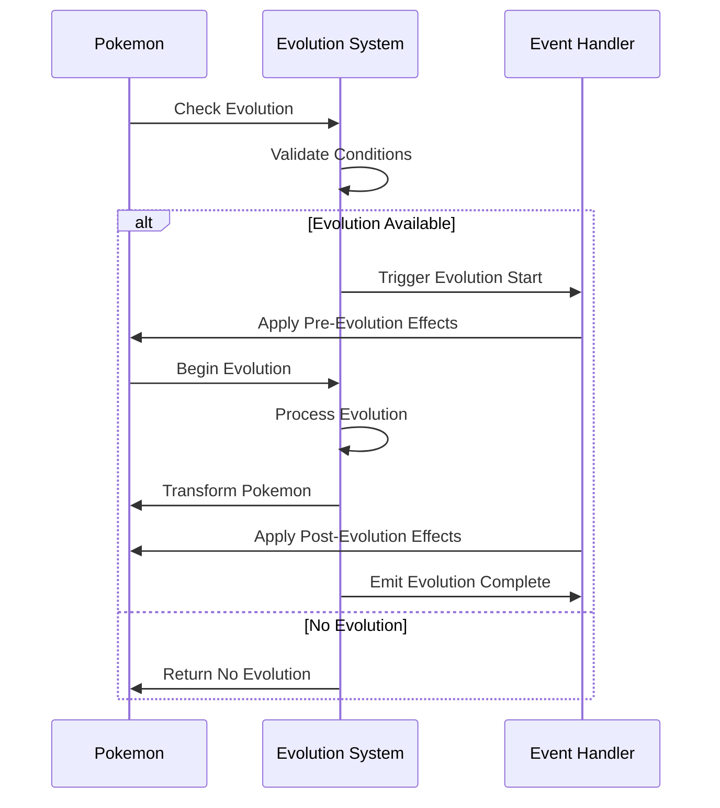

# Pokemon Evolution System

## Overview

The Pokemon Evolution System manages Pokemon evolution mechanics, including level-based evolution, item-based evolution, trade evolution, and special conditions. The system integrates with the Universal Data Layer to support cross-system evolution triggers and rewards.

## Evolution Flow



## Evolution Types

### 1. Level-Based Evolution
```yaml
level_evolution:
  conditions:
    - min_level: required_level
    - happiness: optional_min_happiness
    - time_of_day: optional_time
  examples:
    - species: "Charmander"
      evolves_to: "Charmeleon"
      level: 16
    - species: "Golbat"
      evolves_to: "Crobat"
      happiness: 220
```

### 2. Item-Based Evolution
```yaml
item_evolution:
  conditions:
    - item: required_item
    - location: optional_location
  examples:
    - species: "Pikachu"
      evolves_to: "Raichu"
      item: "Thunder Stone"
    - species: "Eevee"
      evolves_to: "Vaporeon"
      item: "Water Stone"
```

### 3. Trade Evolution
```yaml
trade_evolution:
  conditions:
    - trade: required
    - held_item: optional_item
  examples:
    - species: "Machoke"
      evolves_to: "Machamp"
      condition: "trade"
    - species: "Onix"
      evolves_to: "Steelix"
      condition: "trade"
      held_item: "Metal Coat"
```

## Evolution Mechanics

### 1. Evolution Check
```python
def check_evolution(pokemon: Pokemon) -> Optional[Evolution]:
    """Check if a Pokemon can evolve."""
    evolution_data = get_evolution_data(pokemon.species)
    
    for evolution in evolution_data:
        if meets_conditions(pokemon, evolution.conditions):
            return evolution
            
    return None

def meets_conditions(pokemon: Pokemon, conditions: Dict) -> bool:
    """Check if Pokemon meets evolution conditions."""
    if "level" in conditions and pokemon.level < conditions["level"]:
        return False
        
    if "happiness" in conditions and pokemon.happiness < conditions["happiness"]:
        return False
        
    if "item" in conditions and not has_item(pokemon.trainer, conditions["item"]):
        return False
        
    return True
```

### 2. Evolution Processing
```python
async def process_evolution(pokemon: Pokemon, evolution: Evolution) -> bool:
    """Process Pokemon evolution."""
    try:
        # Start evolution
        await emit_event("evolution_start", pokemon)
        
        # Store pre-evolution data
        pre_evo_data = store_pre_evolution_data(pokemon)
        
        # Apply evolution
        await apply_evolution(pokemon, evolution)
        
        # Calculate stat changes
        await calculate_new_stats(pokemon)
        
        # Learn evolution moves
        await learn_evolution_moves(pokemon)
        
        # Emit completion
        await emit_event("evolution_complete", {
            "pokemon": pokemon,
            "pre_evolution": pre_evo_data
        })
        
        return True
        
    except EvolutionError as e:
        await handle_evolution_error(e, pokemon)
        return False
```

### 3. Stat Calculation
```python
def calculate_evolution_stats(pokemon: Pokemon, evolution: Evolution) -> Stats:
    """Calculate new stats after evolution."""
    base_stats = get_base_stats(evolution.species)
    
    new_stats = Stats(
        hp = calculate_hp(base_stats.hp, pokemon.level, pokemon.ivs.hp),
        attack = calculate_stat(base_stats.attack, pokemon.level, pokemon.ivs.attack),
        defense = calculate_stat(base_stats.defense, pokemon.level, pokemon.ivs.defense),
        sp_attack = calculate_stat(base_stats.sp_attack, pokemon.level, pokemon.ivs.sp_attack),
        sp_defense = calculate_stat(base_stats.sp_defense, pokemon.level, pokemon.ivs.sp_defense),
        speed = calculate_stat(base_stats.speed, pokemon.level, pokemon.ivs.speed)
    )
    
    return new_stats
```

## Evolution Events

### Event Types
1. **Pre-Evolution Events**
   - Evolution availability check
   - Condition validation
   - Pre-evolution preparation
   - Evolution cancellation

2. **Evolution Events**
   - Evolution start
   - Stat recalculation
   - Move learning
   - Form change

3. **Post-Evolution Events**
   - Evolution completion
   - Pokedex update
   - Achievement check
   - Experience adjustment

### Event Handling
```python
@event_handler
async def handle_evolution_event(event):
    match event.type:
        case "evolution_check":
            await check_evolution_availability(event.data)
        case "evolution_start":
            await start_evolution_process(event.data)
        case "evolution_complete":
            await complete_evolution(event.data)
        case "evolution_error":
            await handle_evolution_error(event.data)
```

## Evolution UI

### Command Interface
```
/evolve check <pokemon>
/evolve start <pokemon>
/evolve cancel
/evolve info <pokemon>
```

### Evolution Display
```
✨ Evolution Available!
Pokemon: Charmander Lv.16
Can evolve into: Charmeleon
Requirements: ✅ All conditions met

Stats Change Preview:
HP: 39 → 58
Attack: 52 → 64
Defense: 43 → 58
Sp. Attack: 60 → 80
Sp. Defense: 50 → 65
Speed: 65 → 80

New Moves Available:
- Slash (Level 16)
- Dragon Breath (Level 18)

Type /evolve start to begin evolution
```

## Integration Points

### Input Systems
- Level up events
- Item usage
- Trade completion
- Time-based triggers

### Output Systems
- Stat updates
- Move pool changes
- Pokedex records
- Achievement triggers

## Error Handling

### Evolution Errors
```python
class EvolutionError(Exception):
    """Base class for evolution errors"""
    pass

class ConditionError(EvolutionError):
    """Evolution conditions not met"""
    pass

class ItemError(EvolutionError):
    """Required item not available"""
    pass

class ProcessError(EvolutionError):
    """Evolution process failed"""
    pass
```

### Error Recovery
1. Evolution cancellation
2. State restoration
3. Item return
4. Event cleanup

## Performance

### Optimization
- Evolution data caching
- Stat calculation optimization
- Event batching
- Condition pre-checking

### Metrics
- Evolution process time
- Success rate
- Cache hit ratio
- Event processing time

## Testing

### Unit Tests
```python
def test_evolution_conditions():
    pokemon = Pokemon("Charmander", level=16)
    evolution = get_evolution_data("Charmander")
    
    assert meets_conditions(pokemon, evolution.conditions)
    assert check_evolution(pokemon) is not None
```

### Integration Tests
```python
async def test_evolution_process():
    pokemon = Pokemon("Charmander", level=16)
    
    await process_evolution(pokemon, get_evolution_data("Charmander"))
    
    assert pokemon.species == "Charmeleon"
    assert pokemon.level == 16
    assert "Slash" in pokemon.moves
```

## Related Documentation
- [Pokemon Commands](./commands.md)
- [Pokemon API](./api.md)
- [Battle System](./battle-system.md)
- [Trading System](./trading-system.md)

## Changelog

### v1.0.0 - 2024-02-16
- Initial evolution system implementation
- Basic evolution mechanics
- Evolution UI and commands
- Event system integration

_Last Updated: February 2024_ 