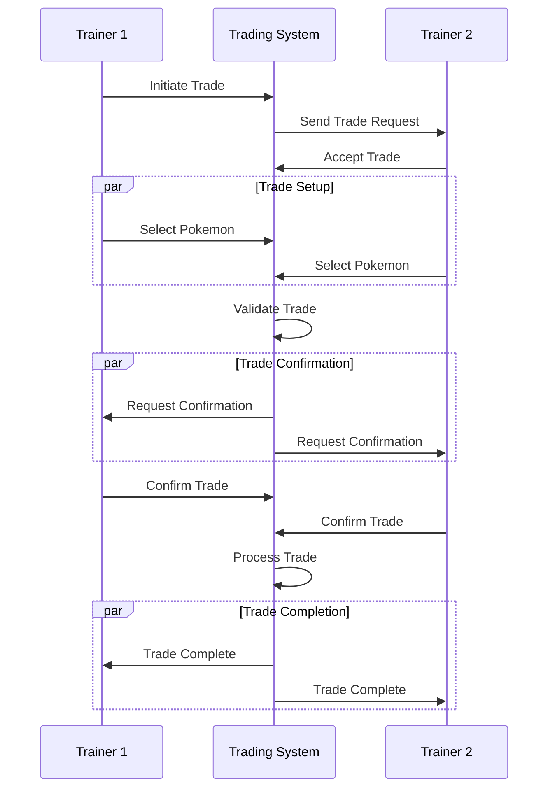

# Pokemon Trading System

## Overview

The Pokemon Trading System enables secure and reliable Pokemon trading between users. The system supports direct trades, trade validation, value assessment, and trade history tracking while integrating with the Universal Data Layer.

## Trading Flow



## Trade States

### 1. Pre-Trade
- Trainer validation
- Pokemon ownership verification
- Trade rule checking
- Initial value assessment

### 2. Active Trade
- Pokemon selection
- Value comparison
- Trade validation
- Confirmation process

### 3. Post-Trade
- Pokemon transfer
- History recording
- Achievement updates
- Notification dispatch

## Trading Rules

### Basic Rules
```yaml
trade_rules:
  max_pokemon: 6
  level_restrictions: false
  evolution_cancel: false
  held_items: true
  special_forms: true
```

### Restrictions
```yaml
restrictions:
  banned_pokemon:
    - "Mythical"
    - "Event-exclusive"
  level_caps:
    min_level: 1
    max_level: 100
  cooldown: 300  # seconds
```

## Trading Mechanics

### 1. Trade Validation
```python
def validate_trade(trade):
    """Validate a proposed trade."""
    # Check trainer eligibility
    if not check_trainers(trade.trainer1, trade.trainer2):
        raise TradeError("Invalid trainer status")
        
    # Verify Pokemon ownership
    if not verify_ownership(trade.pokemon1, trade.trainer1):
        raise TradeError("Pokemon ownership verification failed")
        
    # Check trade restrictions
    if not check_restrictions(trade.pokemon1, trade.pokemon2):
        raise TradeError("Trade violates restrictions")
        
    # Validate trade value
    if not validate_value(trade.pokemon1, trade.pokemon2):
        raise TradeWarning("Significant value difference")
```

### 2. Value Assessment
```python
def assess_value(pokemon):
    """Calculate Pokemon trade value."""
    value = 0
    
    # Base value factors
    value += calculate_base_value(pokemon.species)
    value += level_multiplier(pokemon.level)
    
    # Additional factors
    value += rarity_bonus(pokemon.species)
    value += iv_bonus(pokemon.ivs)
    value += shiny_bonus(pokemon.is_shiny)
    value += held_item_value(pokemon.held_item)
    
    return value
```

### 3. Trade Processing
```python
async def process_trade(trade):
    """Process a confirmed trade."""
    async with transaction():
        # Transfer Pokemon
        await transfer_pokemon(
            trade.pokemon1, trade.trainer1, trade.trainer2)
        await transfer_pokemon(
            trade.pokemon2, trade.trainer2, trade.trainer1)
            
        # Update trade history
        await record_trade(trade)
        
        # Trigger achievements
        await check_trade_achievements(trade)
        
        # Send notifications
        await notify_trade_complete(trade)
```

## Trade Events

### Event Types
1. **Trade Events**
   - Trade initiation
   - Pokemon selection
   - Trade confirmation
   - Trade completion

2. **Validation Events**
   - Ownership verification
   - Restriction checks
   - Value assessment
   - Rule validation

3. **System Events**
   - History recording
   - Achievement updates
   - Notification dispatch
   - Error handling

### Event Handling
```python
@event_handler
async def handle_trade_event(event):
    match event.type:
        case "trade_initiated":
            await setup_trade(event.data)
        case "pokemon_selected":
            await validate_selection(event.data)
        case "trade_confirmed":
            await process_confirmation(event.data)
        case "trade_completed":
            await finalize_trade(event.data)
```

## Trading UI

### Command Interface
```
/trade initiate <@trainer>
/trade add <pokemon>
/trade remove <pokemon>
/trade confirm
/trade cancel
```

### Trade Display
```
💱 Trade: User1 ⟷ User2
Status: Awaiting Confirmation

User1's Offers:
1. Pikachu Lv.25 ⚡
   IVs: 31/28/30/25/28/31
   Held Item: Light Ball

User2's Offers:
1. Charmander Lv.20 🔥
   IVs: 28/31/25/30/28/31
   Held Item: None

Type /trade confirm to accept
Type /trade cancel to decline
```

## Integration Points

### Input Systems
- Command processing
- Event handling
- Value calculation
- Trade validation

### Output Systems
- Trade results
- History updates
- Achievement tracking
- Notifications

## Error Handling

### Trade Errors
```python
class TradeError(Exception):
    """Base class for trade errors"""
    pass

class OwnershipError(TradeError):
    """Pokemon ownership verification failed"""
    pass

class RestrictionError(TradeError):
    """Trade violates restrictions"""
    pass

class ValidationError(TradeError):
    """Trade validation failed"""
    pass
```

### Error Recovery
1. Trade cancellation
2. State rollback
3. Pokemon return
4. History correction

## Performance

### Optimization
- Value calculation caching
- Batch Pokemon transfers
- Efficient validation checks
- Event batching

### Metrics
- Trade processing time
- Validation latency
- Transfer success rate
- System load

## Testing

### Unit Tests
```python
def test_trade_validation():
    trade = Trade(trainer1, trainer2)
    trade.add_pokemon(pokemon1, trainer1)
    trade.add_pokemon(pokemon2, trainer2)
    
    assert validate_trade(trade)
    assert assess_value(pokemon1) == assess_value(pokemon2)
```

### Integration Tests
```python
async def test_trade_flow():
    trade = await initiate_trade(trainer1, trainer2)
    
    await trade.add_pokemon(pokemon1, trainer1)
    await trade.add_pokemon(pokemon2, trainer2)
    
    assert await trade.confirm()
    assert verify_ownership(pokemon1, trainer2)
    assert verify_ownership(pokemon2, trainer1)
```

## Related Documentation
- [Pokemon Commands](./commands.md)
- [Pokemon API](./api.md)
- [Trade Events](../events/trade-events.md)

## Changelog

### v1.0.0 - 2024-02-16
- Initial trading system implementation
- Value assessment system
- Trade validation
- History tracking

_Last Updated: February 2024_ 